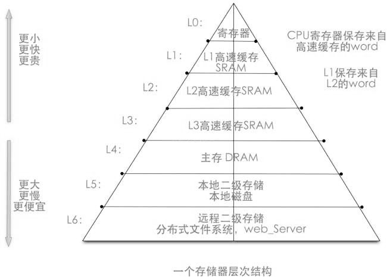
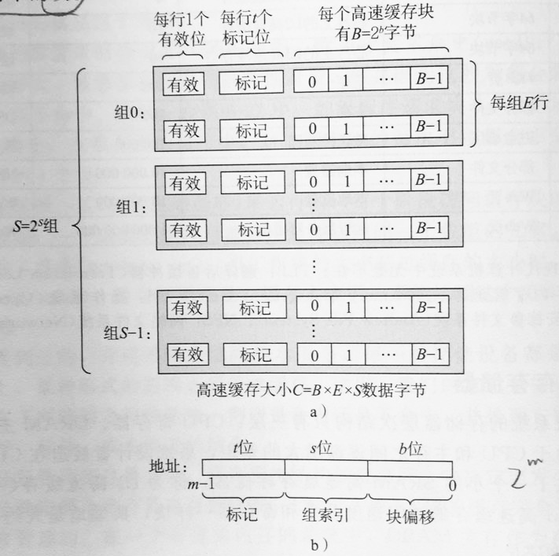
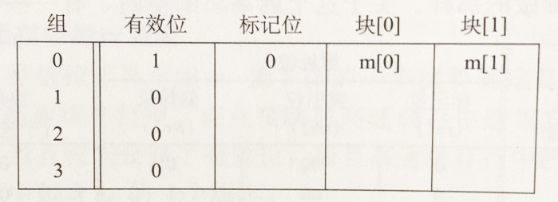

缓存机制

缓存的实现机制

一、为什么要使用缓存

由于不同的存储技术在存储速度和造价上相差巨大，为了高效的访问数据，现代计算机的存储系统会把最常用的数据放在读存速度快的存储设备上，而把不常用的数据放在读存速度慢的存储设备上。存储器系统是一个具有不同容量、成本和访问时间的存储设备的层级结构。从上往下容量越来越大，但访问速度越来越慢。上一层做为下一层的缓存来存储访问频率更高的数据，比如，cpu寄存器保存着最常用的数据。靠近CPU的小的、快速的高速缓存存储器是内存上一部分数据和指令的缓冲区域。主存缓存磁盘上的数据，而这些磁盘又常常作为存储在通过网络连接的其他机器的磁盘或磁带上的数据的缓冲区域。存储层次如下：
;

二、缓存如何判断哪些数据是更常用的

缓存上存储的数据是那些计算机认为在接下来更有可能访问到的数据，计算机如何判断哪些数据接下来更有可能用到呢？系统对程序员编写的代码有两种假设：
1. 时间局部性
时间局部性假设目前访问的数据在接下来也更有可能再次访问到，所以计算机会把刚刚访问过的数据放入缓存中；
2. 空间局部性
空间局部性假设与目前访问的数据相邻的那些数据接下来也更有可能访问到，所以会把当前数据周围的数据放入缓存中；
一个编写良好的代码往往符合时间局部性和空间局部性。

三、数据在存储器层次之间以块为单位进行传递

存储器层次结构的本质是，每一层存储设备都是较低一层的缓存。为了利用空间局部性，存储器上的数据都是按块划分的，每个块包含多个字节的数据。第k层的缓存包含第k+1层块的一个子集的副本。数据总是以块为传送单位在第k层和第k+1层来回复制的。在层次结构中任何一对相邻的层次之间块大小是一样的。不过不同的层次之间块大小可以不同，一般而言，越靠近底层，越倾向于使用较大的块。

四、cup如何访问数据
当程序需要第k+1层的某个数据时，它首先在第k层的一个块中查找d，这里会出现两种情况：
1. 缓存命中
d刚好缓存在k层中，这里称之为缓存命中，该程序直接从k层读取d，根据存储器层次结构，这要比从k+1层取数据更快。
2. 缓存不命中
d没有缓存在k中，这种情况称之为缓存不命中，第k层的缓存从第k+1层中取出包含d的那个块，放在k层中，然后从k层读出d。这里涉及一个问题，即从k+1层中取出的块应如何放置在k层中，这里需要某种放置策略。可用的策略如下：
（1）随机放置，在k中随机选择一个位置进行放置，这种策略实现起来通常很昂贵，因为不好定位；
（2）分组放置，将第k+1层的某个块放置在第k层块的某个小组（子集）中；

五、从一个简单的层次模型理解高速缓存是如何实现的

1. 高速缓存的结构及与地址的对应关系
高速缓存使用分组放置策略，它把存储空间分为S组，每组E行，每行包含1个块，每个块的大小为B，它的结构可以用四元组（S，E，B，m）来表示，其中m代表地址位的个数。高速缓存的容量为C=S*E*B；
当访问数据时，我们唯一知道的是数据的地址。通过地址我们如何从缓存中找到数据所在的组号，块号和块中的位置呢？这里m个地址位分为了3个字段，其中高位的字段为t个标记位，它唯一的标记了组中的块，中间的字段为s个索引位，它标记了组号，最后的字段为块偏移，通过它可以访问块中具体的字节。另外缓存结构中每一行最前面还有一个有效位，它标志了这一行有没有存储块。缓存结构如下：
;

2. 一个简单的存储模型
下面定义一个简单的存储层次模型：
（1）cpu和内存之间只加了一层高速缓存；
（2）存储地址为4位，即内存中最多存16个字节；

4位的地址被分为成了3段：最高位的1段为标记位，中间2位为索引组，最后1位为块偏移。从索引组的的位数可判断缓存被分成了4组，1位的块偏移说明块的大小为2个字节。这里假设每组只有1行，这种情况称为直接映射高速缓存。从以上分段可知，缓存大小为 4*2*1=8 字节；

3. 缓存过程

（1）初始状态缓存是空的，当cpu通过地址（假设为0001）要加载一个数据时，此时cpu会先查找高速缓存，通过中间的地址00找到第0组，通过缓存最前面的有效位判断缓存不命中，然后从内存中取得地址0001处的值。注意此时不会从内存中只取0001处的值，而是根据缓存的块的大小取得1个块，即2个字节，即0000和0001两处的值。然后会把这两个值存储在组索引为0，偏移量为0和1的地址处，并且把当前行的有效位设置为1，标记位设置为0，最后高速缓存返回新取出的高速缓存块[0]处的值；
;

（2）接下来，cpu如果要取0000处的值，此时也会先查找缓存，通过中间2位00找到缓存的组数为0，通过第1个有效位（1）和标记位（0）判断缓存命中，此时会直接返回偏移量0处的值，不需要再查找内存；

（3）如果接下来cpu要取1000处的值，此时会查找到组0，由于地址的标记位为1，和缓存组0中行的标记位（0）不符合，所以缓存不命中，cpu会从内存中取得相应的块，并把缓存组0处的数据覆盖掉，此时会把组的标识位设置为1。

（4）接下来再读地址0000处的值，此时又会发生缓存不命中，因为上面引用地址1000时，把块替换掉了。这种情况称为冲突不命中，也就是说我们有足够的高速缓存空间，但是却交替地引用映射到同一个组的块；

小结：
cpu加载机制为，通过地址先查找缓存，查找过程为，先通过地址中间的组索引位，找到组，然后根据组中行的有效位和标记位判断是否缓存命中，如果命中，则直接从缓存中取数据；如果没命中，则从内存中取出1个块，并用某种放置策略放在缓存中，然后从缓存返回值。在直接映射高速缓中，内存中的空间和缓存中的空间是一种多对一的映射关系，比如本例中地址0和地址8所指的内存空间的内容，在缓存中都存在第0组偏移量为0的空间中；他们的在缓存中的区分由地址的最高位即标记位决定。

六、解决缓存冲突问题

1. 什么是缓存冲突
当每个组只有一行的情况下，映射为同一组的块在缓存中将占用同一个存储空间，当反复加载位于同一组的两个块时，由于每次加载都会把先前加载的块覆盖掉，导致cpu对缓存的命中率为0，虽然此时在其他组依然有大量的缓存空间。

2.组相联高级缓存
为了降低缓存冲突，可以把每个组分为多行，每行存储一个块。cpu通过组索引查找块所在的组，然后通过有效位和标记位检查多行来判断是否缓存命中。当在缓存中找不到时，会从内存中加载一个块到缓存相对应的组中，当组内有空行时，会直接加载到空的行，否则缓存会使用某种替换策略来换掉组内的一行。常用的替换策略有随机替换，最近最少使用原则，即替换掉组内最长时间未使用的行。当缓存中只有1个组，组中包含所有行时，称为全相联高速缓存。

七、如何编写缓存友好的代码
为了更好的利用缓存，提高代码执行速度。需要编写局部性良好的代码，提高缓存命中率，下面是基本方法
1. 把注意力集中在核心函数的循环上；
2. 对局部变量的反复引用有良好的时间局部性；
3. 步长为1的引用模型有很好的空间局部性，当扫描二维数组时要一行一行的扫描，而不是一列一列的扫描；

