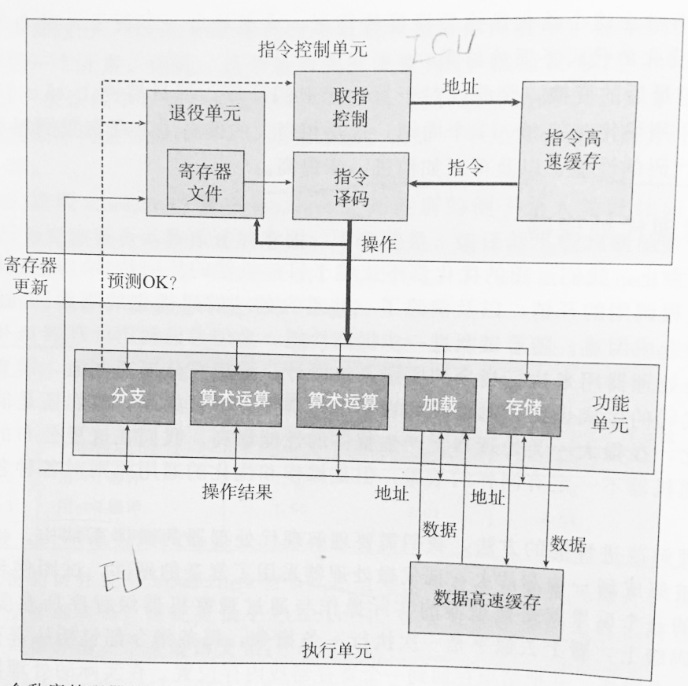

优化程序性能的基本策略

一、高级设计
为遇到的问题选择适当的算法和数据结构。
这要求我们对各种算法的时间复杂度和空间复杂度有一个基本的了解。并要理解各种数据结构的优缺点，要针对解决的问题选择适当的数据结构。比如数组和链表的选择：对于想要快速访问数据，不经常有插入和删除元素的时候，选择数组。对于需要经常的插入和删除元素，而对访问元素时的效率没有很高要求的话，选择链表。

二、基本编码原则
1. 代码移动
这类优化包括识别要执行多次（例如在循环里）但是计算结果不会改变的值，然后将计算部分移动到代码前面不会被多次求值的部分。比如下面例子，每次循环都需要调用函数检查字符串的长度，如果我们确定字符串长度不会在循环中改变的话，可以把求字符串的过程移在循环前面：
```
//优化前
void fun(){
	for(int i=0;i<strlen(s);i++){
		//某些操作...
	}
}

//优化后
void fun(){
	int len=strlen(s);//把固定的值写在循环外面
	for(int  i=0;i<len;i++){
		//某些操作...
	}
}
```
2. 减少属性查找
在web开发中，访问对象的属性是一个O（n）操作，对象上的任何属性查找都要比访问变量或者数组花费更长的时间，因为必须在原型链上对拥有该名称的属性进行一次搜索。简而言之，属性查找越多，执行时间越长。当多次用到对象属性时，应该将其存储在局部变量中。举例如下：
```
//优化前，需要6次查找
var query=window.location.href.substring(window.location.href.indexOf("?"));

//优化后，只需要4次查找
var url=window.location.href;
var query=url.substring(url.indexOf("?"));
```
另外，如果即可以用数字化的数组进行访问，也可以使用命名属性，那么使用数字位置。

3. 减少过程调用
过程调用会带来额外的开销，比如在内存栈中分配空间，存储相关变量等。不过此优化原则只有在必要的时候才需要考虑，因为它是以损害代码的模块性为代价的。

4. 消除不必要的内存引用
由于访问寄存器要比访问内存快的多，所以在写代码时，尽量引入中间变量来保存中间结果。只有在最后的值计算出来时，才将结果存放到对象、数组或全局变量中。

三、低级优化――处理器中指令的执行过程

为了进一步提高性能，我们需要应用现代处理器的指令级并行能力，这要求我们理解现代处理器的微体系结构。

1. 现代处理器中指令的执行过程
在代码级上，指令看上去似乎是一次执行一条，而在实际的处理器中，是同时对多条指令求值的，这个现象称为指令级并行，在某些设计中，可以有100或更多条指令在处理中。现代处理器的整个设计主要有两个部分：指令控制单元和执行单元。前者负责从内存中读出指令序列，并根据这些指令序列通过译码生出一组针对程序数据的基本操作。而后者执行这些操作。通常，指令控制单元每个时钟周期会把多条指令转换出来的多个基本操作（每条指令会转换为一个或多个基本操作），发送给执行单元，在执行单元中，这些操作会被分派到一组功能单元中，它们会并行的执行实际的操作。示例图如下：
;

2. 分支预测
由于一条指令在实际执行之前，就会被取值、译码并将操作发送给执行单元，即在代码执行之前已经对代码进行了一系列处理。当遇到分支时，现代处理器会采取分支预测技术，提前加载和译码预测的分支会跳到的地方的指令，当分支操作被送到执行单元时，执行单元确定分支预测是否正确，如果错误会丢弃分支点之后计算出来的结果，并指出正确的分支目的。预测错误会导致很大的性能开销。
3. 寄存器更新
每条指令的执行都会伴随着寄存器的更新，当指令被分解为可并行执行的操作，并且指令有可能处于错误的分支上时，什么时候会更新寄存器呢？在指令译码时，关于指令的信息会放置在一个队列中。当一条指令的所有操作都完成了，并且所有引起这条指令的分支点也都被确认为预测正确，那么这条指令就可以退役了，所有对程序寄存器的更新都可以实际被执行了。
4. 举例
执行过程分析举例，有如下代码：
```
a=a*data[i];
i++；
```
设a存在寄存器%xmm0中，data+i存在寄存器&rdx中，则上面的代码的汇编代码如下：
```
vmulsd (%rdx),%xmm0,%xmm0
addq $8,%rdx
```
在控制单元中会将这两个指令分解为三个操作，即1个加法操作，1个加载操作和1个乘法操作。这里乘法操作和加法操作更新时依赖的是不同的寄存器，所以两者可以并行执行。而乘法操作依赖于加载操作，即需要先加载完%rdx处的值，再执行乘法操作。假设乘法操作所用时间为3个时钟周期，加法和加载分别使用1个时钟周期。则上面两条指令总共会花费4个时钟周期，而不是5个。

小结
通过对处理器运行原则的了解，我们会发现有两种下界描述了程序的最大性能：
延迟界限：
延迟指的是一条指令从开始执行到结束所用时间，当一系列操作必须按照严格顺序执行时，就会遇到延迟界限，因为在下一条指令执行之前，这条指令必须结束。当代码中的数据相互关联导致无法利用处理器指令级并行能力的时候，延迟界限会限制程序性能。
吞吐量界限：
要理解吞吐量界限，需要先理解一个概念：发射。发射指处理器某个功能单元通过流水线执行一系列相同操作时，两个操作间隔的时钟周期（想象一下流水线上的产品，一个产品从进入流水线到成品出来也许需要5分钟，但两个产品的间隔只有5秒，因为有大量产品同时处在流水线上）。吞吐量指每个时钟周期所能执行的操作个数，当某个功能单元发射为T时，其吞吐量为1/T，当有C个执行相同操作的功能单元时，吞吐量为C/T。吞吐量界限为程序性能的终极限制。

四、低级优化――优化策略
低级优化的目的就是使操作能够像流水线一样执行，后一个操作不需要等前一个操作完成，即它不需要依赖前一个操作的数据，从而使代码性能达到吞吐量界限。常用的方法如下：
1. 循环展开
循环展开是一种程序变换，通过增加每次迭代计算的元素数量，从而减少迭代次数。
举例：
```
sum=0
for(i=0;i<len;i++){
	sum+=a[i];
}
//可展开如下
for(i=0;i<len-1;i+=2){
	sum+=a[i];
	sum+=a[i+1];
}
for(;i<len;i++){
	sum+=a[i];
}
```
循环展开的主要目的是可以对循环体内的操作进行优化，从而使多个操作可以并行执行，常用的优化手段有定义多个累积变量和重新结合变换；

2. 多个累积变量
对于一个可结合和可交换的合并运算来说，比如说整数加法或乘法，我们可以通过将一组合并运算分割成两个或更多部分，并在最后合并结果来提高性能。例如多个数乘积，可以将奇数项乘积和偶数项乘积放在不同的变量中，最后在对两个变量求乘积。
举例：上面循环展开循环体内的代码可以优化如下：
```
sum1=0;
sum2=0;
//循环展开如下
for(i=0;i<len-1;i+=2){
	sum1+=a[i];
	sum2+=a[i+1];
}
for(;i<len;i++){
	sum1+=a[i];
}
sum=sum1+sum2;
```
上例中循环体内的两个操作因为没有依赖关系，所以会并行执行。

3. 重新结合变换
通过乘法和加法的结合律，将与寄存器无关的合并操作结合在一齐，可使多个操作并行执行。下例中第二种写法比第一种快很多
```
r=r*a[i]*a[i+1]
r=r*(a[i]*a[i+1])
```

4. 条件数据传送
为了避免分支预测错误造成的代价，可以采用条件数据传送代替条件判断


