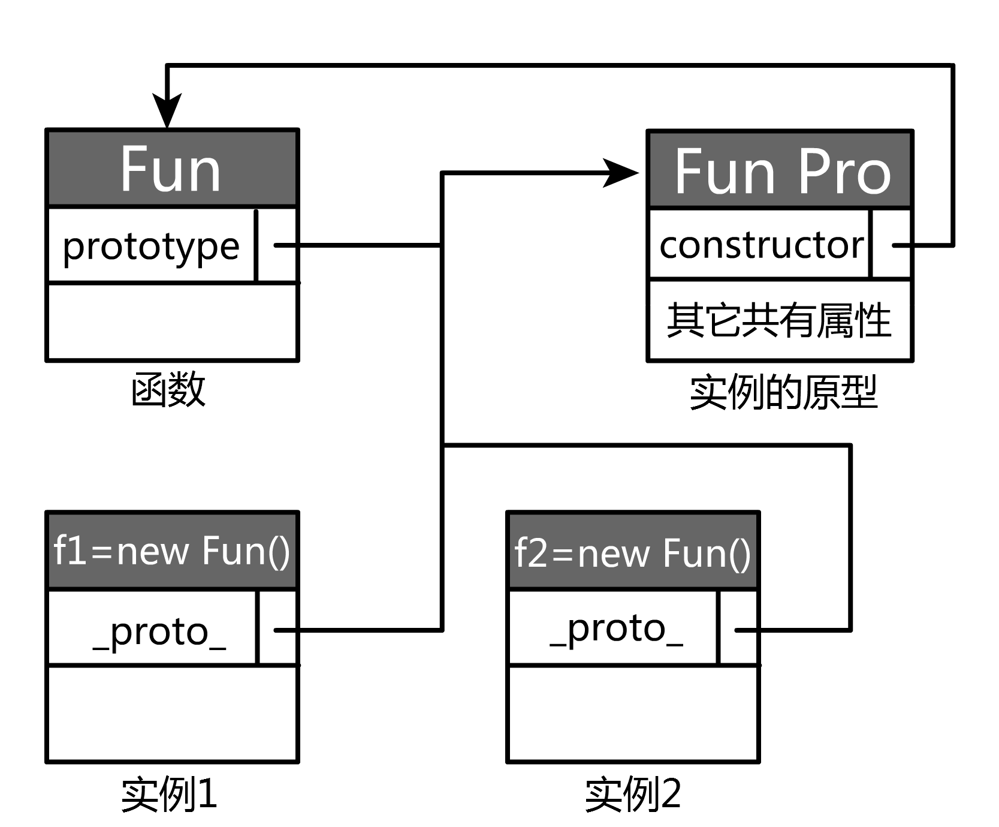
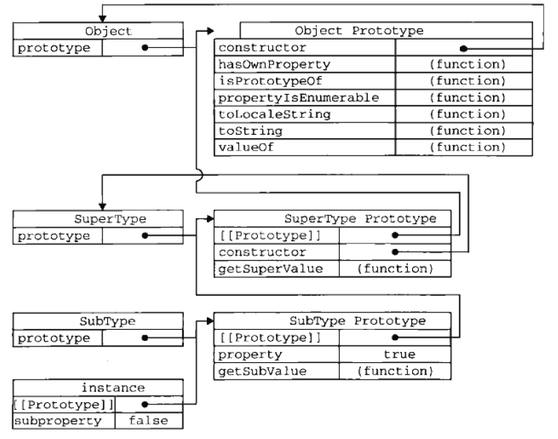

### 理解原型
js创建的每个函数都有一个prototype属性，这个属性指向一个对象。这个对象用来存储通过这个函数所创建的所有实例共有的属性和方法， 这个对象称为所有实例的原型对象。每个原型对象都包含一个constructor属性，它指向prototype属性所在的函数。
;

### 搜索对象属性的过程
每当代码读取某个对象的某个属性时，都会执行一次搜索，目标是具有给定名字的属性。搜索首先从对象实例本身开始。如果在实例中找到了具有给定名字的属性，则返回该属性的值；如果没有找到，则继续搜索_proto_指针指向的原型对象，在原型对象中查找具有给定名字的属性。如果在原型对象中找到了这个属性，则返回该属性的值。

通过实例只能访问原型对象的值，不能修改原型对象的值。如果我们在实例中添加了一个属性，而该属性与实例原型中的一个属性同名，那么就会在实例中创建该属性，该属性将屏蔽掉原型中的那个属性。

### 使用原型实现继承
1.继承的含义
继承是面向对象编程中的一个重要概念，通过继承可以使子类的实例使用在父类中定义的属性和方法。

2.实现继承
在js中我们可以创建一个对象o，通过这个对象可以访问父类中定义的所有属性和方法，然后把这个对象作为子类实例的原型对象。 这样的话子类实例就可以通过搜索原型来访问父类中的所有属性和方法，通过这种方式我们就
实现了继承。一般情况下可以通过创建父类对象的实例来创建对象o;举例如下：
```javascript
function Animal(){
	
}

Animal.prototype.shout=function(word){
	console.log(word);
}

function Bird(){
	
}
Bird.prototype=new Animal();
//为原型添加constructor属性;
Bird.prototype.constructor=Bird;

var bird=new Bird();
bird.shout("gugugu...");

```
上例中shout属性的查找过程：先查找bird实例，没找的，再查找bird的原型对象，即Animal的实例，没找到，接下来查找Animal实例的原型，找到。由于每一个实例都有一个原型，通过这种方式就会形成一条原型链，图示如下：
;
### 封装一个实现继承的方法
```javascript
function extend(subclass, superclass) {
	"use strict";
	//创建一个对象作为子类的原型对象
	function o() { this.constructor = subclass; }
	//设置对象的原型为父类的原型，从而使对象可以访问父类方法
	o.prototype = superclass.prototype;
	return (subclass.prototype = new o());
};
```

